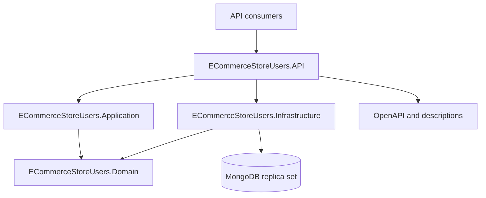

# ECommerceStoreUsers

.NET 10 Minimal API for customer profiles, admin profiles, and client favorites.
The API uses application services and a MongoDB replica set. Customer and admin
writes maintain current and history collections; favorites have a separate
collection. The repository includes Domain, Application, Infrastructure and
Reqnroll HTTP acceptance tests.

Profiles and favorites have a different data model and write lifecycle from
product browsing, orders and invoices. Users owns this data and can evolve and
deploy independently. Alongside
[ProductsCatalog](https://github.com/MichalBoczula/ProductsCatalog), it is a
reference implementation with architecture chosen for its own domain.

## Engineering approach

### Designed contracts, executable sources

Design routes, DTOs, validation, HTTP outcomes and acceptance scenarios before
implementation. Express the agreed behavior in endpoint metadata, domain
policies, application flows and Reqnroll tests. Swashbuckle generates OpenAPI
from those sources; this repository does not commit a second handwritten
specification, operation catalogue or generated client.

CI checks that named operations link to executed service methods, flow
descriptors, registered policies and acceptance scenarios. It exports and lints
OpenAPI from the running API and compares declared responses with the status,
media type and DTO shape observed by acceptance tests. This verifies exercised
behavior, not every conceivable runtime response.

### Flow and policy descriptions

Application services execute ordered steps described by their flow descriptors.
Domain policies expose rule and error descriptions. The API serves these at
`/users-documentation/flows` and `/users-documentation/validations`.
Generated links and OpenAPI are ignored verification artifacts, not another
specification to maintain. See
[ADR-0005](docs/adr/0005-generated-documentation-sources.md). A hosted
Allure/API portal and RAG ingestion are [later work](TECHNICAL_TODO.md).

## Architecture



| Layer | Responsibility |
| --- | --- |
| `ECommerceStoreUsers.API` | Minimal API routes, response metadata, safe errors, OpenAPI, health checks and composition. |
| `ECommerceStoreUsers.Application` | Customer, Admin and Favorite services, DTO mapping and ordered flow descriptors. |
| `ECommerceStoreUsers.Domain` | Aggregates, repository interfaces, validation policies, rules and domain errors. |
| `ECommerceStoreUsers.Infrastructure` | MongoDB documents and mappings, repositories, transactions, indexes, startup configuration and readiness. |

MongoDB document types stay in Infrastructure; the API calls application
services and Infrastructure implements Domain repository contracts. Users does
not copy ProductsCatalog's CQRS/MediatR and SQL read/write split. CI checks
dependency and persistence boundaries.

## Why MongoDB and how history works

A Customer has individual data and embedded companies; an Admin is a separate
profile aggregate. MongoDB stores current Customers, Admins and Favorites in
separate collections, and resulting snapshots of Customer and Admin changes in
their own history collections. Snapshots record action, time, aggregate ID and
version. Favorites have no history collection.

Customer and Admin creates write current and history together in a MongoDB
transaction. Updates replace current data using optimistic `Version` matching
and append history in that transaction. A stale version causes a conflict;
a missing Customer on update is distinguished from a conflict. An unchanged
Admin update adds neither a version nor a history entry. Customer updates do
not have a general no-op guarantee.

Favorites use individual inserts/deletes and a unique `(ClientId, ProductId)`
index. Profile transactions require a writable replica-set primary with
sessions. Named indexes are created at startup; conflicting definitions stop
startup instead of rebuilding existing indexes. See
[ADR-0001](docs/adr/0001-mongodb-documents-and-history.md) and
[index evolution](docs/mongo-index-evolution.md).

## Technology stack

| Area | Technology |
| --- | --- |
| Runtime and API | .NET 10, ASP.NET Core Minimal APIs |
| Application flow | Application services and source flow descriptors |
| Database | MongoDB 8 replica set, MongoDB .NET Driver |
| API contract | Swashbuckle OpenAPI, Redocly CLI validation |
| Unit tests | xUnit, Shouldly, Moq |
| Integration and HTTP tests | Testcontainers for MongoDB, Reqnroll, xUnit, Allure adapter |
| Coverage | Coverlet collector, ReportGenerator |
| Containers | Docker, Docker Compose |
| CI | GitHub Actions, NuGet Audit, Dependency Review, Gitleaks, Trivy |

## Repository structure

```text
src/
  ECommerceStoreUsers.API/
  ECommerceStoreUsers.Application/
  ECommerceStoreUsers.Domain/
  ECommerceStoreUsers.Infrastructure/
tests/
  ECommerceStoreUsers.AcceptanceTests/
  ECommerceStoreUsers.Application.UnitTests/
  ECommerceStoreUsers.Domain.UnitTests/
  ECommerceStoreUsers.Infrastructure.UnitTests/
  ECommerceStoreUsers.Performance.BenchmarkTests/
docs/
  adr/
  acceptance-matrix.md
  health-checks.md
  local-startup.md
  mongo-index-evolution.md
TECHNICAL_TODO.md
```

## Prerequisites

- Docker with Compose for the local API and MongoDB replica set.
- Bash, Python 3, Node.js 22 and .NET SDK `10.0.100` (pinned in
  [`global.json`](global.json)) for the full
  [`scripts/verify.sh`](scripts/verify.sh) check.
- For Windows Compose, `APPDATA` must point to the usual Windows profile folder
  because [`docker-compose.yml`](docker-compose.yml) mounts UserSecrets and HTTPS
  certificate paths from it. On another host, set `APPDATA` to an appropriate
  local folder before starting Compose. HTTPS is not needed for the HTTP examples.

## Run locally with Docker Compose

From the repository root, copy [`.env.example`](.env.example) to the ignored
`.env` file and replace the example password with a local password. In Bash:

```bash
cp .env.example .env
# Edit .env: set MONGODB_PASSWORD to a local-only password.
docker compose up -d --build
curl -i http://localhost:8080/health/live
curl -i http://localhost:8080/health/ready
```

On Windows PowerShell, use `Copy-Item .env.example .env` instead of `cp`.
Compose starts MongoDB, initializes the single-node `rs0` replica set, then
starts the API. Wait for `/health/ready` to return `200` before making API calls.
The API receives its connection string through
`MongoDbSettings__ConnectionString`; the collection names and database name are
defined in [`appsettings.json`](src/ECommerceStoreUsers.API/appsettings.json).
See [local startup](docs/local-startup.md) for probe deadlines and failures.

The API is exposed at `http://localhost:8080`; MongoDB maps container port
`27017` to host port `27018`. The replica set advertises `compose-mongodb`,
which is resolvable inside Compose but may require host-side DNS configuration
for local database tools.

Stop the stack without deleting the named `mongo-data` volume:

```bash
docker compose down
```

Remove containers and local MongoDB data when a fresh database is needed:

```bash
docker compose down --volumes
```

## API contract and executable documentation

- Swagger UI: <http://localhost:8080/swagger>
- Generated OpenAPI: <http://localhost:8080/swagger/v1/swagger.json>
- Source-generated flow and policy descriptions: `/users-documentation/flows`
  and `/users-documentation/validations`.

Business routes live under `/customers`, `/admins`, and `/favorites`. Read the
generated OpenAPI for their current operations, bodies and response contracts;
the repository does not maintain a second handwritten endpoint catalog.
Acceptance scenarios are related to operation IDs in
[`docs/acceptance-matrix.md`](docs/acceptance-matrix.md). The error response
format is described in [`docs/api-problem-contract.md`](docs/api-problem-contract.md).
CI derives operation-to-flow-to-policy-to-scenario links from source and
compares actual acceptance HTTP responses to generated OpenAPI for exercised
scenarios. Flow/policy descriptors stay next to the code that executes them.
Clients should branch on the stable problem `code` rather than the error title
or detail. Health responses use their documented plain-text format.

## Health and startup

| Probe | Purpose |
| --- | --- |
| `/health/live` | Process liveness, independent of MongoDB. |
| `/health/ready` | Writable MongoDB replica-set primary and sessions; returns `503` when unavailable. |
| `/health` | Compatibility alias for liveness. |

Health checks use plain-text responses; see [health details](docs/health-checks.md).
Readiness has a five-second timeout and performs no business write or index
rebuild. Use it for traffic routing; use liveness for process checks. At
startup a read-only MongoDB probe makes up to three bounded attempts before
named index initialization runs once. A conflicting index or failed
initialization stops startup. Business writes and whole index operations are
not retried by that policy; see [local startup](docs/local-startup.md).

## Tests and local verification

Run the full source, contract, architecture, build, test, coverage, OpenAPI and
Docker checks from the repository root:

```bash
bash scripts/verify.sh
```

This requires the SDK, Node.js and a running Docker daemon. TRX, generated
OpenAPI and coverage reports are written under the ignored
`artifacts/verification` directory. Domain and Application each have a 70%
line-coverage threshold; Infrastructure coverage is reported without a
minimum. See [local verification](docs/local-verification.md) for artifacts.

Run restore, build and formatting separately:

```bash
dotnet restore ECommerceStoreUsers.slnx
dotnet build ECommerceStoreUsers.slnx --configuration Release --no-restore
dotnet format ECommerceStoreUsers.slnx --verify-no-changes --no-restore
```

Run individual suites when needed:

```bash
dotnet test tests/ECommerceStoreUsers.Domain.UnitTests/ECommerceStoreUsers.Domain.UnitTests.csproj --configuration Release
dotnet test tests/ECommerceStoreUsers.Application.UnitTests/ECommerceStoreUsers.Application.UnitTests.csproj --configuration Release
dotnet test tests/ECommerceStoreUsers.Infrastructure.UnitTests/ECommerceStoreUsers.Infrastructure.UnitTests.csproj --configuration Release
dotnet test tests/ECommerceStoreUsers.AcceptanceTests/ECommerceStoreUsers.AcceptanceTests.csproj --configuration Release
```

Infrastructure tests exercise MongoDB repositories, transactions and indexes
with Testcontainers. HTTP acceptance tests reuse one replica-set container per
run; each Reqnroll scenario has a separate database, API host and client.
Hooks dispose and drop scenario state even on failure. Scenarios test HTTP
outcomes and current/history effects, including conflicts and rollback. The
OpenAPI export starts separately without MongoDB. Generated `.feature.cs`
files are build artifacts and should not be edited manually. Performance
benchmarks live in `tests/ECommerceStoreUsers.Performance.BenchmarkTests/`
outside the standard CI gate.

## CI pipeline

GitHub Actions runs on pull requests and pushes to `master`:

1. Check source links, architecture boundaries and acceptance matrix; restore,
   verify formatting, build and export/lint OpenAPI with pinned tools.
2. Run Domain, Application, Infrastructure and HTTP acceptance suites with TRX
   and coverage reports; enforce separate Domain/Application coverage gates.
3. Run NuGet high/critical audit, Gitleaks on both events and Dependency Review
   on pull requests. Ordinary compiler warnings remain visible.
4. Require the quality gate, build a local Docker image, then fail the job on
   high/critical Trivy image findings.

Dependency Review is expected to be skipped on a push. CI verifies the Users
image but does not publish it to a registry. See
[ADR-0004](docs/adr/0004-ci-and-security-gates.md) and the
[workflow](.github/workflows/ci.yml) for exact jobs and event conditions.

## Operations and next steps

The API can run with multiple replicas when MongoDB and its named indexes are
ready. Readiness prevents routing to an instance without a writable primary.
Changes to indexes or document shape need a reviewed migration and compatible
rollout; startup does not perform an automatic production schema migration.
History retention and backup/restore still need an operational policy.

Authentication and authorization, production secret delivery, deployment and
observability remain open before exposing the API publicly. Hosted reports,
RAG ingestion and generated-client compatibility for consumers are later work.
The [ADR index](docs/adr/README.md) records decisions in force, and
[`TECHNICAL_TODO.md`](TECHNICAL_TODO.md) separates completed work from
production requirements and deferred ideas.

## Troubleshooting

- **Startup fails or `/health/ready` returns `503`:** inspect
  `docker compose ps` and the logs for `mongo-init`, `compose-mongodb`, and
  `ecommercestoreusers.api`. Check the `.env` credentials, replica-set primary
  and MongoDB reachability. The API stops on a conflicting named index instead
  of changing it automatically; see [index evolution](docs/mongo-index-evolution.md).
- **The host cannot connect using the Compose URI:** `compose-mongodb` is the
  hostname inside the Compose network. Port `27018` is exposed for local tools,
  but the replica set advertises its container hostname; use a hostname the
  client can resolve when connecting from outside Compose.
- **Acceptance or Infrastructure tests cannot start:** start Docker and verify
  that Testcontainers can create a MongoDB replica set. The OpenAPI export test
  itself starts without MongoDB.
- **`APPDATA` mount error:** set `APPDATA` to a host folder accessible to Docker,
  or use the default Windows profile location. The Compose file contains these
  mounts even when using only HTTP locally.
